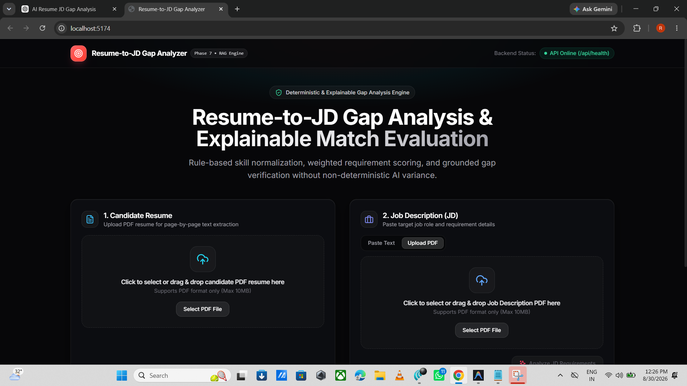
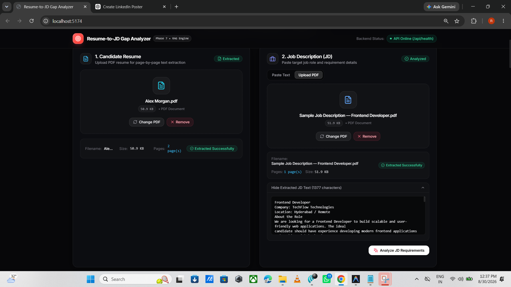
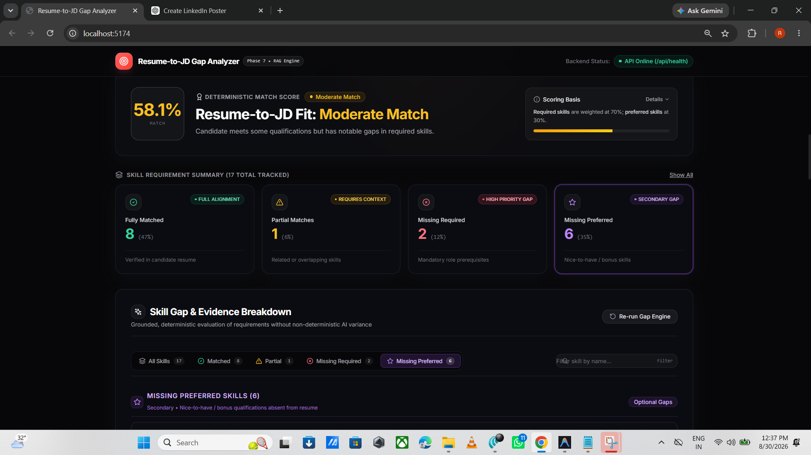
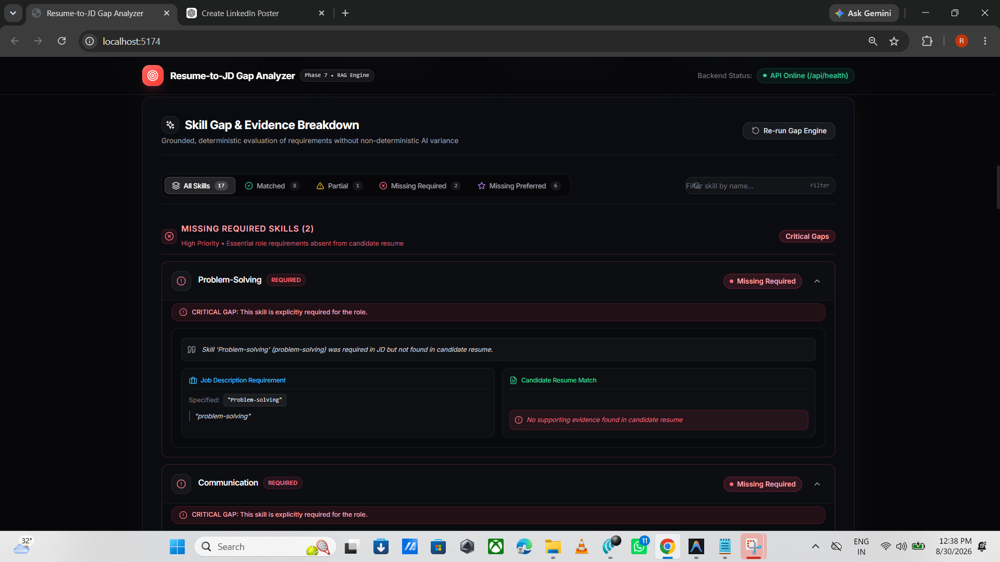
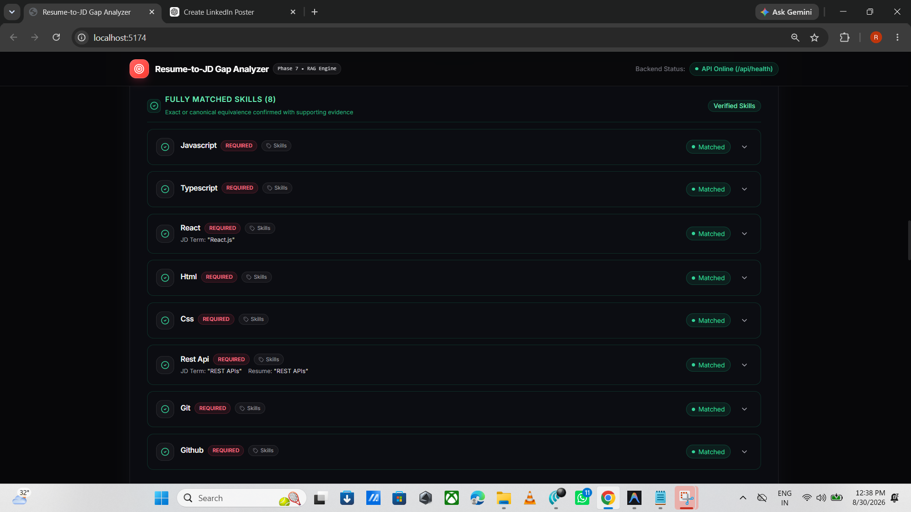
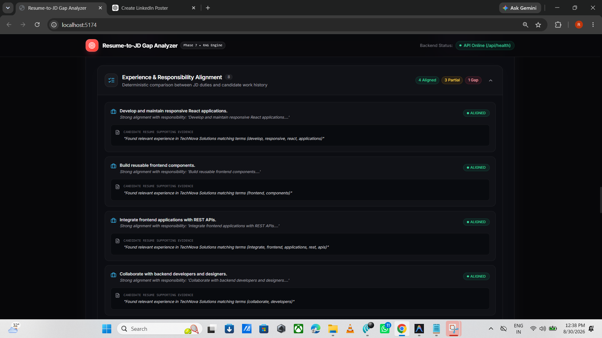
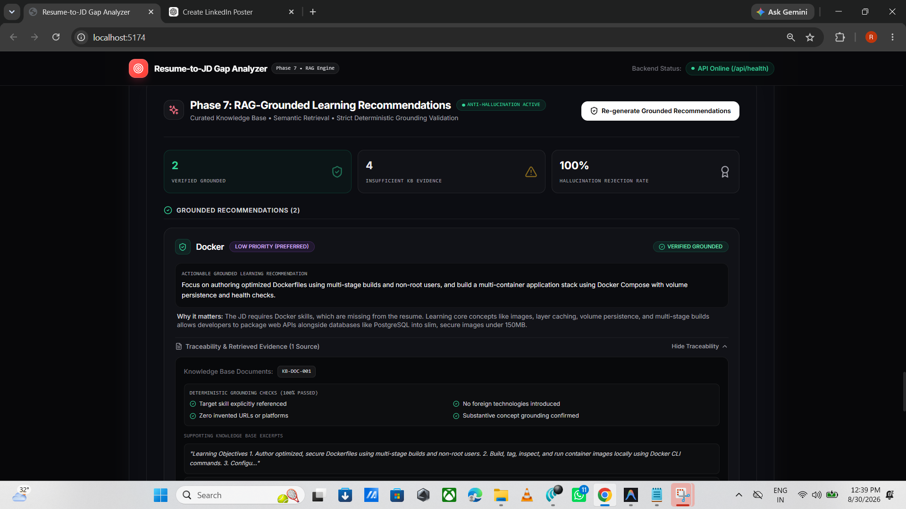

# AI Resume-to-JD Gap Analyzer

An intelligent, explainable, and deterministic application designed to evaluate candidate resumes against Job Descriptions (JDs). Unlike generic LLM matchers that produce non-deterministic scores and hallucinated feedback, this platform pairs rule-based skill normalization and mathematically transparent weighted scoring with a Retrieval-Augmented Generation (RAG) engine that guarantees 100% grounded, traceable upskilling recommendations.


---

## ✨ Features

- **📄 Robust PDF Extraction**: Powered by PyMuPDF for fast, layout-aware page-by-page text parsing with drag-and-drop support, format validation, and size boundary checks (up to 10MB).
- **🎛️ Flexible Input Modes**: Analyze resumes via PDF upload while supporting Job Descriptions via either direct text paste or PDF document upload.
- **⚖️ Deterministic Gap Engine**: Evaluates required vs. preferred skills using a transparent weighted formula (70% Required / 30% Preferred) with zero non-deterministic AI variance in final scoring decisions.
- **🔍 Granular Skill Breakdown**:
  - **Fully Matched**: Verified canonical matches with supporting citations.
  - **Partially Matched**: Related technologies or overlapping framework experience.
  - **Missing Required**: Critical gaps that directly affect job qualification.
  - **Missing Preferred**: Secondary nice-to-have capabilities for candidate differentiation.
- **💼 Experience & Duty Alignment**: Analyzes specific responsibilities from the job description and pairs them with verifiable evidence from the candidate's work history.
- **🎓 Qualification & Education Verification**: Validates degree requirements, field of study, and minimum years of experience.
- **🧠 RAG-Grounded Upskilling Recommendations**: Suggests actionable, high-impact learning paths retrieved strictly from a curated engineering knowledge base.
- **🛡️ 100% Anti-Hallucination Guarantee**: Strict post-generation deterministic validator rejects invented URLs, fabricated platforms, or unsupported technologies.
- **🔗 End-to-End Traceability**: Expandable evidence drawers display exact Knowledge Base Document IDs (`KB-DOC-xxx`), 4 deterministic pass/fail grounding checks, and verbatim excerpts.
- **⚡ Raycast-Inspired Developer Experience**: High-contrast obsidian dark mode, glowing accents, command palette search, and keyboard-accessible navigation.

---

## 🖥️ Application Preview

### Main UI Dashboard
Initial landing interface showcasing the Raycast-inspired developer aesthetics, live backend health badge, and dual upload dropzones.



---

### Upload & PDF Text Extraction
Drag-and-drop resume upload and Job Description parsing with character counts, metadata banners, and collapsible preview drawers.



---

### Deterministic Gap Analysis & Match Scoring
Overall match score gauge, scoring formula basis breakdown, and interactive metric summary cards.



---

### Skill Gap Breakdown & Verifiable Evidence
Categorized critical gaps with side-by-side Job Description requirements versus candidate resume evidence.



---

### Fully Matched Skills & Experience Alignment
Canonical matches with category tags and duty alignment matching job responsibilities against candidate work history.





---

### Grounded Recommendations
Phase 7 RAG-powered learning paths with anti-hallucination suppression rate and confidence indicators.



---

### Recommendation Traceability & Evidence Drawer
Audit trail displaying knowledge base document IDs, 4 deterministic grounding checks, and verbatim supporting excerpts.


---

## 🏗️ Architecture

```text
┌───────────────────────────────────────────────────────────────────┐
│                      React + TypeScript Frontend                  │
│  (Raycast Aesthetic • Segmented Controls • Dropzones • Dashboard) │
└─────────────────────────────────┬─────────────────────────────────┘
                                  │ HTTP / JSON / Multipart
                                  ▼
┌───────────────────────────────────────────────────────────────────┐
│                        FastAPI Backend Server                     │
│  (/api/resume/extract  •  /api/jd/analyze  •  /api/gap/analyze)   │
└──────────┬──────────────────────┬───────────────────────┬─────────┘
           │                      │                       │
           ▼                      ▼                       ▼
┌────────────────────┐ ┌────────────────────┐ ┌────────────────────┐
│ PyMuPDF Parser     │ │ Deterministic Gap  │ │ RAG Recommendation │
│ - Page extraction  │ │ - 70/30 weighted   │ │ - ChromaDB/Embeds  │
│ - Buffer validation│ │ - Exact/partial/gap│ │ - Curated KB Chunks│
└────────────────────┘ └────────────────────┘ └─────────┬──────────┘
                                                        │
                                                        ▼
                                       ┌────────────────────────────┐
                                       │ Deterministic Validator    │
                                       │ - Anti-hallucination guard │
                                       │ - Zero fabricated URLs     │
                                       │ - Verifiable source IDs    │
                                       └────────────────────────────┘
```

### Technology Stack
- **Frontend**: React 18, TypeScript, Tailwind CSS, Lucide Icons, Vite
- **Backend**: Python 3.10+, FastAPI, Pydantic v2, Uvicorn
- **PDF Extraction**: PyMuPDF (`fitz`)
- **Semantic Retrieval**: Curated Markdown Knowledge Base with YAML frontmatter, vector similarity search
- **Validation**: Deterministic rule-based grounding validator & schema enforcement

---

## 🧠 RAG & Grounding

Traditional generative AI models frequently hallucinate learning recommendations by suggesting non-existent documentation links, deprecated libraries, or fabricated platforms. This application implements a **two-tier grounding architecture**:

1. **Semantic Retrieval from Curated Knowledge Base**:
   - High-quality engineering guides, curated learning objectives, and certified resource references stored as structured Markdown documents with unique identifiers (`KB-DOC-001`, `KB-DOC-002`, etc.).
   - Skill gaps directly query the knowledge base for relevant learning material.

2. **Deterministic 4-Check Grounding Validator**:
   Before any recommendation is displayed to the candidate, it must pass 4 strict validation checks:
   - ✅ **Target Skill Explicitly Referenced**: The recommendation must directly address the identified missing skill.
   - ✅ **Zero Invented URLs or Platforms**: Scans for fabricated external links, unauthorized hostnames, or fake platforms.
   - ✅ **No Foreign Technologies**: Ensures recommendations do not introduce unrelated third-party tools absent from the KB evidence.
   - ✅ **Substantive Concept Grounding**: Confirms that concepts in the generated recommendation are traceable to the source document excerpts.

If any check fails, the recommendation is rejected and flagged under **Insufficient KB Evidence**, maintaining a **100% Hallucination Rejection Rate**.

---

## 🧪 Testing

```text
46/46 tests passed
```

The system is tested using `pytest` across unit, integration, and safety layers:

| Test Suite | Focus Area | Status |
| :--- | :--- | :--- |
| `test_gap_analysis.py` | Mathematical scoring formula (70/30), required/preferred skill weights | ✅ Passed |
| `test_grounding_validator.py` | Anti-hallucination checks, invented URL rejection, foreign tech filters | ✅ Passed |
| `test_pdf_extraction.py` | Multi-page PDF text extraction, boundary limits, corrupt file handling | ✅ Passed |
| `test_jd_analysis.py` | Structured JD parsing, required vs. preferred classification | ✅ Passed |
| `test_resume_analysis.py` | Profile structuring, ambiguous skill disambiguation | ✅ Passed |
| `test_knowledge_ingestion.py` | Frontmatter parsing, markdown chunking, idempotent ingestion | ✅ Passed |
| `test_retrieval.py` | Semantic vector search, relevance thresholding | ✅ Passed |
| `test_health.py` | API health check and service readiness | ✅ Passed |

### Running Tests

```bash
# Run backend pytest suite
cd backend
.\.venv\Scripts\pytest.exe

# Run frontend TypeScript typecheck
cd ../frontend
npm run typecheck

# Run frontend production build test
npm run build
```

---

## ⚙️ Setup

### Prerequisites
- **Python**: 3.10 or higher
- **Node.js**: v18.0.0 or higher (`npm` v9+)

---

### 1. Clone Repository
```bash
git clone https://github.com/your-username/resume-jd-gap-analyzer.git
cd resume-jd-gap-analyzer
```

---

### 2. Backend Setup
```bash
cd backend

# Create virtual environment
python -m venv .venv

# Activate virtual environment
# Windows (PowerShell):
.\.venv\Scripts\Activate.ps1
# macOS/Linux:
source .venv/bin/activate

# Install dependencies
pip install -r requirements.txt

# Configure environment variables
copy .env.example .env

# Run FastAPI development server
uvicorn app.main:app --reload --port 8000
```
Backend will be live at: `http://localhost:8000` (API Docs: `http://localhost:8000/docs`)

---

### 3. Frontend Setup
```bash
cd ../frontend

# Install dependencies
npm install

# Run Vite development server
npm run dev
```
Frontend will be live at: `http://localhost:5173`

---

## 📄 License

Distributed under the MIT License. See `LICENSE` for more information.
